  <picture>
    <source media="(max-width: 760px)" srcset="assets/banner-mobile.svg">
    
  </picture>

  
  
  
  
  
  

  

##  Hey, I'm Mohamed

**SOC Analyst & DFIR Specialist** specializing in security monitoring, proactive threat detection, digital forensics, and security tool engineering. Currently completing intensive SOC & cybersecurity tracks at **NTI** (Fortinet SecOps) and **ITI** (Enterprise Network Hardening), working in DFIR at the **Digital Egypt Pioneers Initiative (DEPI)**, and serving as a **Cybersecurity Instructor at Zero2Aura**.

  

##  Core Expertise & Skills

####  &nbsp;Security Operations & SIEM / EDR

  
  
  
  
  
  
  
  

####  &nbsp;Threat Intelligence & Detection Engineering

  
  
  
  
  
  
  

####  &nbsp;Digital Forensics & Incident Response (DFIR)

  
  
  
  
  
  

####  &nbsp;Enterprise Network Architecture & Hardening

  
  
  
  
  
  
  

####  &nbsp;Languages, Automation & SecOps

  
  
  
  
  
  
  
  

  

##  Featured Open-Source Projects

| Project | Description | Stack / Focus |
| :--- | :--- | :--- |
| 🔍 **[ThreatScopeX](https://github.com/0xsabry/ThreatScopeX)** | Advanced log intelligence and threat detection engine with 115+ built-in detection rules | Python, MITRE ATT&CK, Sigma, STIX 2.1 |
| 📑 **[IR-Report-Generator](https://github.com/0xsabry/IR-Report-Generator)** | Browser-based incident response reporting tool supporting 40+ security tool artifacts | HTML5, CSS3, JS, MITRE Navigator |
| 🛡️ **[SOC Lab Project](https://0xsabry.github.io/soc-lab-project/)** | End-to-end enterprise attack simulation, Wazuh detection, and automated IR simulation | Wazuh, Sysmon, EventLogs, Ubuntu, PowerShell |
| 🎣 **[Phishing IR Framework](https://github.com/0xsabry)** | Complete 6-phase email forensic investigation framework aligned with NIST 800-61 | Email Header Forensics, IOC Extraction |

  

##  Experience & Internships

 &nbsp; <strong>National Telecommunication Institute (NTI)</strong> | <em>SOC Analyst Intern (FortiAnalyzer + FortiSIEM)</em> | <strong>August 2026 – Present</strong> 
• Completing intensive SOC Analyst track focused on Fortinet Security Operations workflows: event examination, event handlers, automated playbooks, forensic analysis, and threat intelligence reporting. 
• Using <strong>FortiAnalyzer</strong> for log collection and analysis, FortiView searches, incident management, threat hunting, custom reports, and Incident Response playbook creation and monitoring. 
• Operating <strong>FortiSIEM</strong> for real-time and historic searches, event correlation, custom incident rules, dashboard configuration, and UEBA-based threat hunting with FortiGuard Threat Intelligence. 
• Practicing detection, analysis, and remediation of security incidents using traditional and AI/ML-assisted methods; preparing for <strong>FCP – Security Operations</strong> and <strong>NSE 6 FortiSIEM Analyst</strong> certifications.

 &nbsp; <strong>Information Technology Institute (ITI)</strong> | <em>Cybersecurity Intern</em> | <strong>April 2026 – Present</strong> 
• Engineered and hardened multi-zone enterprise network architecture in Cisco Packet Tracer with multi-VLAN Layer 2/3 segmentation, dynamic DHCP, and multi-area OSPF routing for secure high-availability communication. 
• Designed and enforced Extended ACLs to control traffic flow, isolate wireless zones, and restrict management-plane and server access to authorized hosts. 
• Hardened network appliances by enforcing cryptographic SSH on VTY lines and restricting management access; successfully defended architecture before ITI evaluation panel. 
• Completed modules in Cyber Security Essentials, Ethical Hacking & Vulnerability Assessment, and Huawei HCCDA Tech Essentials (cloud computing and ICT infrastructure).

 &nbsp; <strong>Digital Egypt Pioneers Initiative (DEPI)</strong> | <em>Digital Forensics Investigator</em> | <strong>Jan 2025 – Present</strong> 
• Conducting digital forensics examinations, artifact analysis, and memory/disk investigation.

 &nbsp; <strong><a href="https://www.linkedin.com/company/zero-2-aura/">Zero2Aura Tech Academy</a></strong> | <em>Cybersecurity Instructor</em> | <strong>Oct 2025 – Present</strong> 
• Training students and aspiring security analysts in Cybersecurity, DFIR, Penetration Testing, and Networking.

 &nbsp; <strong>Digital Egypt Pioneers Initiative (DEPI)</strong> | <em>Cyber Security Incident Response Analyst</em> | <strong>Oct 2024 – May 2025</strong> 
• Analyzed security alerts, mapped incidents to MITRE ATT&CK, and executed IR playbooks.

 &nbsp; <strong>The British University in Egypt (BUE)</strong> | <em>Cyber Security Intern</em> | <strong>Jul 2024</strong>

  

##  GitHub Analytics & Streak

  
  

  

  <picture>
    <source media="(max-width: 760px)" srcset="assets/footer-mobile.svg">
    
  </picture>

