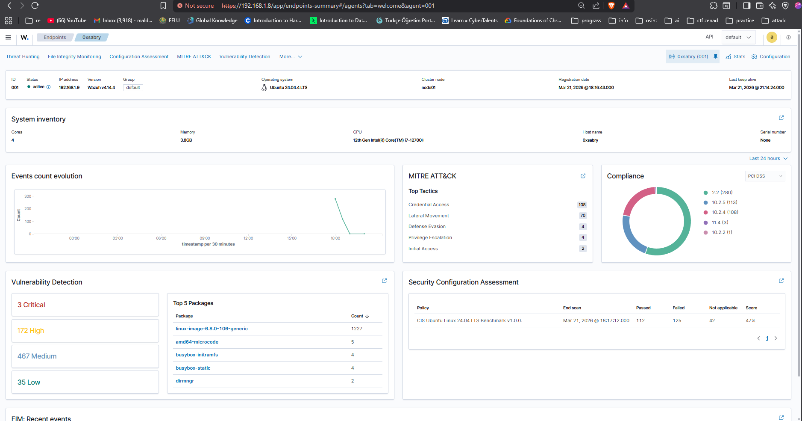
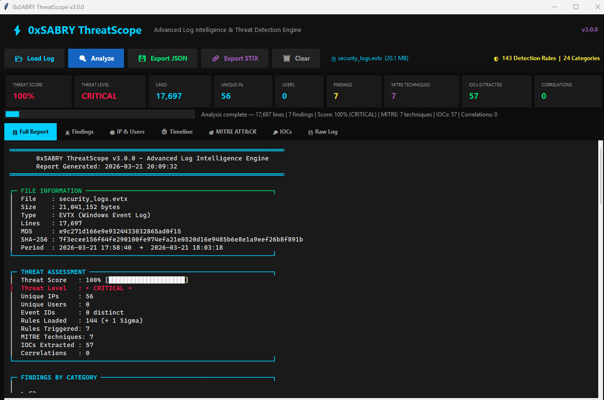

# SOC Lab Project

<p align="center">
  <strong>Automated Threat Detection & Incident Response Simulation</strong><br />
  A hands-on SOC analyst portfolio project built around realistic attack simulation, SIEM detection, threat analysis, and incident response.
</p>

<p align="center">
  
  
  
  
</p>

<p align="center">
  <a href="#highlights">Highlights</a> ·
  <a href="#attack-scenarios">Scenarios</a> ·
  <a href="#lab-architecture">Architecture</a> ·
  <a href="#evidence">Evidence</a> ·
  <a href="#project-assets">Assets</a>
</p>

---

## Overview

This project demonstrates the end-to-end workflow of a Tier 1 Security Operations Center analyst: simulate attack activity, detect it with a SIEM, investigate the evidence, map behavior to the MITRE ATT&CK framework, and document response actions.

The lab combines **Wazuh** for live endpoint monitoring with **ThreatScope**, a custom threat-detection engine used to perform deeper analysis of exported Windows Event Logs. All activity was conducted in an isolated lab environment for defensive learning and portfolio demonstration.

## Highlights

| Detection & analysis | Result |
| --- | --- |
| Attack scenarios simulated | 3 |
| Wazuh events from SSH brute-force activity | 339 |
| Wazuh events from privilege-escalation activity | 407 |
| ThreatScope rules available | 144 built-in + 1 Sigma rule |
| PowerShell log lines analyzed | 1,008 |
| MITRE ATT&CK techniques observed | 12 across 6 tactics |
| Threat-intelligence output | JSON reports and STIX 2.1 bundles |

## Lab Architecture

```text
┌──────────────────────────┐       ┌──────────────────────────┐
│ Windows Host             │       │ Wazuh SIEM               │
│ • ThreatScope            │──────▶│ • Manager & Dashboard    │
│ • PowerShell simulation  │       │ • Alerting & hunting     │
└────────────┬─────────────┘       └────────────▲─────────────┘
             │                                    │
             │              Wazuh agent           │
┌────────────▼─────────────┐                      │
│ Ubuntu Server 24.04 LTS  │──────────────────────┘
│ • Monitored endpoint     │
│ • SSH / sudo scenarios   │
└────────────▲─────────────┘
             │
┌────────────┴─────────────┐
│ WSL2 (Ubuntu)            │
│ • Hydra attack tooling   │
└──────────────────────────┘
```

## Technology Stack

| Area | Tools |
| --- | --- |
| SIEM & endpoint monitoring | Wazuh 4.14.4, Wazuh Agent |
| Threat analysis | ThreatScope v3.0.0 |
| Attack simulation | Hydra, PowerShell, WSL2 |
| Target environment | Ubuntu Server 24.04 LTS |
| Virtualization | VirtualBox, VMware Workstation |
| Framework | MITRE ATT&CK |

## Attack Scenarios

### 1. SSH brute-force attack

A dictionary-based SSH password-guessing simulation was executed from WSL2 against an Ubuntu Server endpoint. Wazuh detected **339 security events** and surfaced activity associated with brute force, password guessing, SSH remote services, and valid-account techniques.

**Response focus:** triage the source, verify authentication outcome, and recommend SSH hardening such as key-only access, disabling root login, and rate limiting.

### 2. PowerShell download cradle

A PowerShell `IEX` download-cradle execution attempt was captured in Windows PowerShell Operational logs and analyzed with ThreatScope. The analysis processed **1,008 log lines**, reached a **critical** threat score, triggered **8 rules**, and extracted **16 IOCs**.

**Response focus:** contain suspicious script activity, extract IOCs, export threat intelligence, and recommend Script Block Logging, execution-policy controls, and AppLocker/WDAC.

### 3. Privilege escalation through sudo abuse

Post-exploitation behavior was simulated by enumerating sudo permissions and accessing sensitive files on Ubuntu. Wazuh captured **407 events**, including sudo-to-root execution and PAM session activity.

**Response focus:** assess sensitive-file exposure, audit sudo entitlements, restrict privileged access, and enable stronger audit coverage.

## MITRE ATT&CK Coverage

The combined detection workflow identified 12 techniques spanning six ATT&CK tactics.

| Tactic | Representative techniques |
| --- | --- |
| Credential Access | `T1110` Brute Force, `T1110.001` Password Guessing |
| Execution | `T1059` Command and Scripting Interpreter |
| Persistence | `T1505.003` Web Shell |
| Privilege Escalation | `T1548.003` Sudo and Sudo Caching, `T1134` Access Token Manipulation |
| Defense Evasion | `T1027` Obfuscated Files, `T1564.004` NTFS Alternate Data Streams |
| Command and Control | `T1090.003` Multi-hop Proxy |

## Evidence

<p align="center">
  
</p>

<p align="center"><em>Wazuh endpoint dashboard showing the monitored Ubuntu agent.</em></p>

<p align="center">
  
</p>

<p align="center"><em>ThreatScope report summarizing the security-log analysis.</em></p>

For the complete walkthrough, metrics, alert details, screenshots, and incident-response recommendations, open **[SOC_Lab_Project_0xSABRY.html](SOC_Lab_Project_0xSABRY.html)** in a modern browser or see the included PDF report.

## Project Assets

```text
.
├── SOC_Lab_Project_0xSABRY.html   # Interactive project report
├── SOC_Lab_Project_0xSABRY.pdf    # Portable report
├── SOC_Lab_Project_0xSABRY.docx   # Editable report source
├── images/                        # Report screenshots and evidence
└── soc-lab-project-0xSABRY.zip    # Packaged project archive
```

## Safe Use

This repository contains documentation and evidence from an authorized, isolated cybersecurity lab. It is intended for defensive education, security analysis, and portfolio review only. Do not use attack techniques or tools against systems without explicit permission.

## Author

**Mohamed Sabry** · SOC Analyst · DFIR  
GitHub: [@0xsabry](https://github.com/0xsabry)

---

<p align="center">Built as a cybersecurity portfolio project · March 2026</p>
